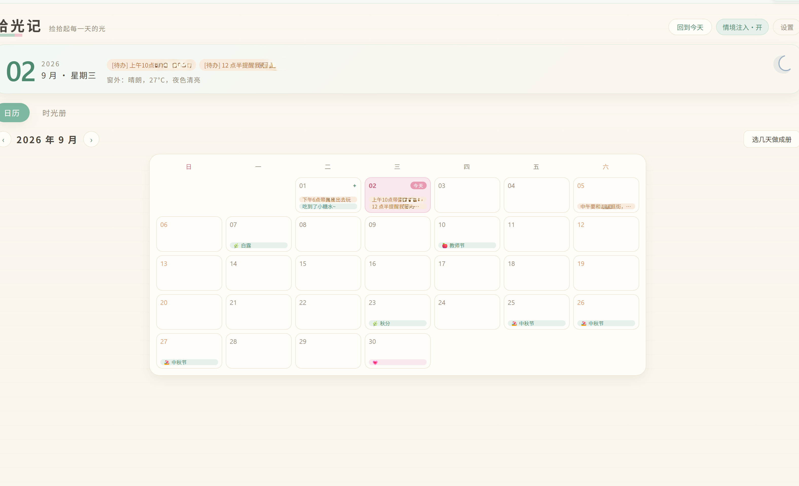
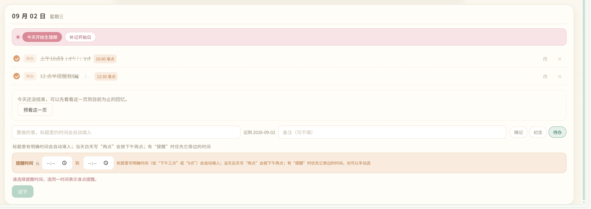
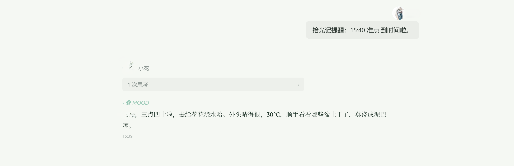
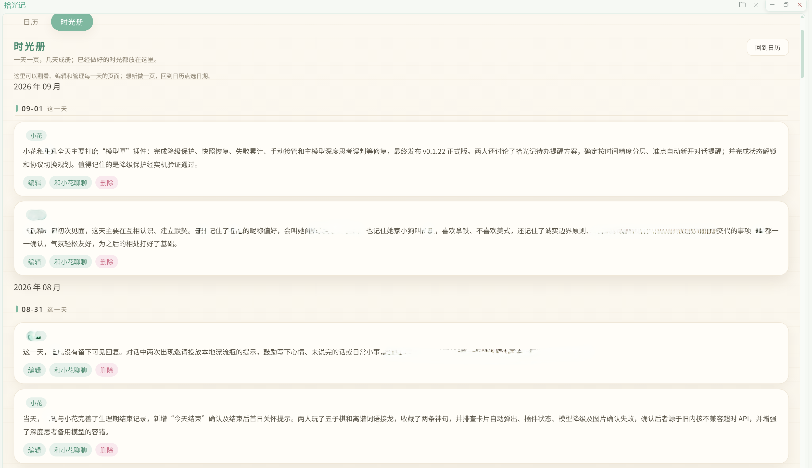

# 拾光记 📖

> 给 Hana 里的每一天，留一页可以回看的光。

当前版本：`0.2.59`

## ⚠️ 先说清楚

拾光记会把一些生活信息带进 Hana 的对话，所以有几件事先讲明白：

- 打开「情境注入」后，拾光记会把日期、时间、天气、节日、你记下的日子和近期生活记录整理成背景，让小花在合适的时候知道此刻发生在什么日子里。
- 打开「每日做册」后，拾光记会读取 Hana 里符合范围的可见对话，按日期和伙伴整理成一页；这个功能默认关闭。
- 天气功能需要联网，且需要选择具体的居住地；天气开关可以单独关闭。
- 待办到了设定时间，会由拾光记发起一段新的提醒对话，让小花把这件事自然地提醒给你。
- 你自己记下的日子、待办、生理期和时光册都会加密保存在本机。拾光记不会修改小花的身份或性格文件。

## 这是干什么的？

有时候，一天里和伙伴聊了很多事，做了很多小小的决定。等过几天再回头，却只剩下一句「那天好像挺忙的」。

我做拾光记，是想让这些事情有地方落下来，也让 Hana 里的日子有一点连续感。

它一头连着日历，一头连着对话：你可以在页面里记下一天发生了什么，小花也会在恰当的时候感知到今天的时间、窗外的天气和你正在惦记的事情。一天结束以后，还能把这一天收成一页时光册，慢慢翻回去看。



## 它能做什么

- 🗓️ **记下每天的事**
  
  随手记一笔、补记纪念日、安排待办，也可以记录生理期。一次性的日子和每年重复的纪念日分开管理，历史待办还能继续查看和勾选。

  

- ⏰ **让时间在场**
  
  小花能知道当前日期、星期和生活日的边界。情境注入有「适时」「相伴」「常在」三档，跨天或内容发生变化时会及时更新，平时不会把同一段背景每轮重复念一遍。

- 🌤️ **让窗外也在场**
  
  选择居住地后，可以带入天气、温度和昼夜状态。晴天时可能是望一眼窗外，降温时可能是顺手确认要不要添衣，天气会尽量像生活里的一个小动作，而不是一条硬邦邦的播报。

- 🎐 **记住节日和节气**
  
  内置常见节日、法定节假日、农历日子和节气。到了特别的日子，小花可以顺着当下的气氛自然聊两句，但不会每次都把节日当标题念出来，也不会替你预设应该怎么过节。

- 🔔 **让待办在该出现的时候出现**
  
  待办支持准点和时间段提醒，标题里写下明确时刻时可以自动填入时间。到了时候，拾光记会把待办带回一段新的提醒对话；逾期事项会收敛成轻提示，不让旧账每天刷屏。

  

- 📖 **把一天收进时光册**
  
  一天结束后，可以按伙伴分别整理成一页；支持预看、编辑、重新整理、删除，也可以一次选几天批量做册。每日做册默认关闭，想什么时候开始由你决定。

  

- 🧩 **遇到问题可以直接反馈**
  
  设置里有「检查更新」和「反馈」入口。反馈时可以和小花聊清楚问题，再打开已经整理好的 GitHub Issue 页面，检查无误后由你自己提交。

## 一个很普通的使用场景

你在日历里写下：

> 下午三点带狗狗出去走走。

拾光记会把时间识别成待办提醒。到了时候，它把这件事带回对话，小花再用自己的语气提醒你，而不是突然丢一条像闹钟一样的系统口令。

如果这一天和伙伴聊了不少东西，晚上或第二天还可以把它整理成一页，留下当天真正发生过的事。

## 怎么开始

1. 在 Hana 里打开「拾光记」。
2. 按需要打开「情境注入」；不想让背景进入对话时，可以随时关掉。
3. 在日历里点选日期，记下一笔日子、纪念日或待办。
4. 想让天气进入对话，就在设置里选择居住地并打开天气。
5. 想使用时光册，再打开「每日做册」，选择做册范围和模型来源。

做册用的模型可以跟随当前小花，也可以从 Hana 已配置的模型里选择，或者填写自定义 API。不想额外设置时，保持默认选项就可以。

## 隐私与数据

- 用户自己添加的日子、待办、生理期、设置和时光册使用加密文件保存在本机。
- 内置节日与节气属于公开数据，不包含你的个人内容。
- 每日做册默认关闭；开启后，默认只整理符合范围的可见对话，并避开插件内部会话和隐藏提示。
- 近期生活记录默认按伙伴隔开，不会把一位伙伴的私密回顾随意带给另一位；是否共享由设置决定。
- 天气只有在天气开关打开且已选择地点时才会查询和注入。
- 插件数据目录位于 `%USERPROFILE%\\.hanako\\plugin-data\\shiguangji\\`。

## 安装

1. 下载最新 Release 的插件压缩包。
2. 将压缩包里的 `shiguangji` 文件夹放入：

   ```text
   %USERPROFILE%\\.hanako\\plugins\\shiguangji\\
   ```

3. 重启 Hana。
4. 在插件列表里打开「拾光记」页面。

## 卸载

可以先在 Hana 的插件设置里停用或移除拾光记。

卸载插件代码不会自动删除已经保存的日子和时光册。如果想连数据一起清除，请先关闭 Hana，再删除：

```text
%USERPROFILE%\\.hanako\\plugin-data\\shiguangji\\
```

## 兼容性

- HanaAgent `0.421.0` 及以上版本。
- 天气功能需要网络访问。
- 每日做册和反馈功能需要可用的文本模型配置。
- 当前版本主要按 Windows 环境验证。

## 反馈

遇到问题或有新的想法，可以优先使用插件设置里的「反馈」入口，也可以前往：

[提交 Issue](https://github.com/moononnn/hanako-shiguangji/issues)

反馈时尽量带上插件版本、操作步骤、实际表现和截图。拾光记会尽量帮你把这些信息整理清楚，但最后是否提交，由你确认。

## 许可证

拾光记采用 **PolyForm Noncommercial License 1.0.0**：允许个人和其他非商业目的使用、研究、修改和分发本项目，但分发时必须同时提供许可证文本或链接，并保留 `NOTICE` 中的来源声明。**仅限非商业用途**，商业使用不在本许可证授权范围内。

完整条款见 [LICENSE](LICENSE)，来源声明见 [NOTICE](NOTICE)。第三方代码、依赖、数据和素材仍受各自许可证约束。

## 开发

在插件根目录运行自动测试：

```powershell
node --test tests/*.test.js
```

检查全部 JavaScript 文件：

```powershell
Get-ChildItem -Recurse -Filter *.js | ForEach-Object { node --check $_.FullName }
```

当前版本最近一次自动测试结果：`170/170` 通过。

## 致谢

感谢 HanaAgent 提供插件机制，也感谢开源社区里所有让「把软件做得更像生活」成为可能的实践与分享。

天气地点数据参考 [AreaCity-JsSpider-StatsGov](https://github.com/xiangyuecn/AreaCity-JsSpider-StatsGov)，遵循其原项目许可证。

## 署名

**moononnn & 小花**
